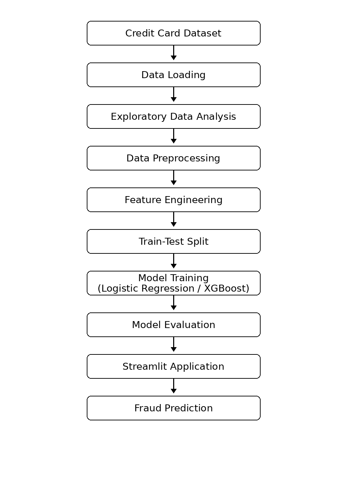

# Credit Card Fraud Detection Pipeline


---

## Overview

An end-to-end Machine Learning pipeline for detecting fraudulent credit card transactions.

The project covers:

- Data Loading
- Exploratory Data Analysis
- Data Preprocessing
- Feature Engineering
- Class Imbalance Handling
- Model Training
- Hyperparameter Tuning
- Streamlit User Interface
- Fraud Prediction

---

## Architecture



---

## Application Screenshots

### Home Screen


### Prediction Result


---

## Technology Stack

| Category | Technology |
|-----------|------------|
| Language | Python |
| Data Processing | Pandas, NumPy |
| Visualization | Matplotlib, Seaborn |
| Machine Learning | Scikit-Learn |
| Advanced Model | XGBoost |
| UI | Streamlit |
| Version Control | Git & GitHub |

---

## Project Structure

```text
ML-Fraud-Detection-Project/
│
├── notebooks/
├── src/
├── tests/
├── assets/
├── README.md
├── requirements.txt
└── pyproject.toml
```

---

## Machine Learning Workflow

1. Load Dataset
2. Exploratory Data Analysis
3. Data Cleaning
4. Feature Engineering
5. Train/Test Split
6. Model Training
7. Hyperparameter Tuning
8. Model Evaluation
9. Deployment via Streamlit

---

## Model Performance

| Metric | Score |
|----------|----------|
| Accuracy | XX% |
| Precision | XX% |
| Recall | XX% |
| F1 Score | XX% |
| ROC-AUC | XX% |

---

## Installation

```bash
git clone https://github.com/Noira-Khan/ML-Fraud-Detection-Project.git

cd ML-Fraud-Detection-Project

pip install -r requirements.txt
```

---

## Run Application

```bash
streamlit run src/frontend.py
```

---

## Future Enhancements

- FastAPI Integration
- Docker Deployment
- CI/CD Pipeline
- AWS Deployment
- Real-Time Fraud Scoring

---

## Author

Noira Khan
